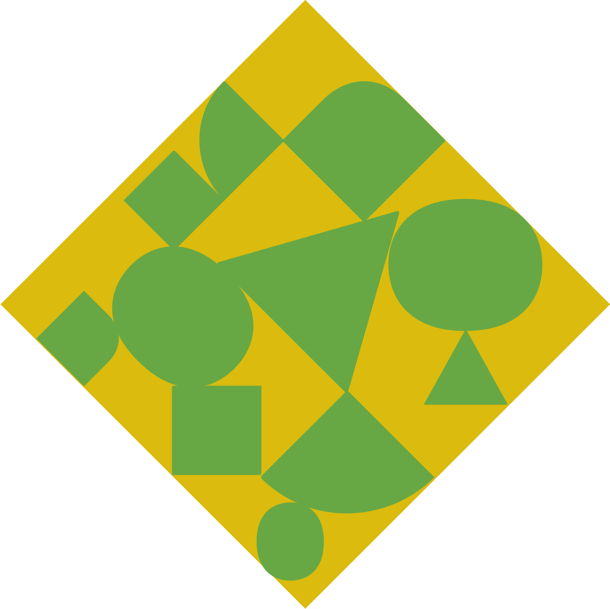
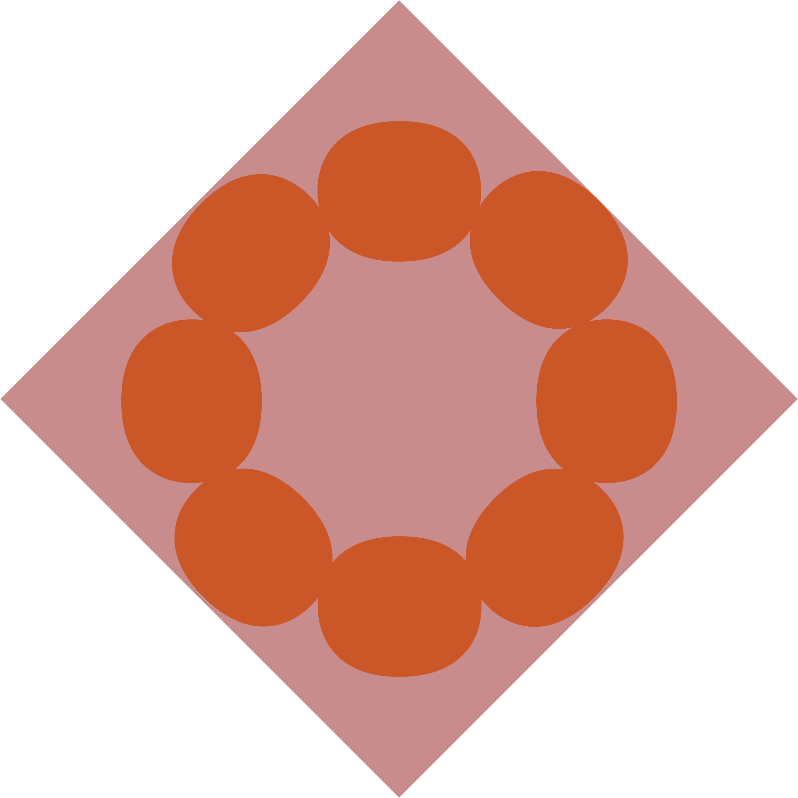
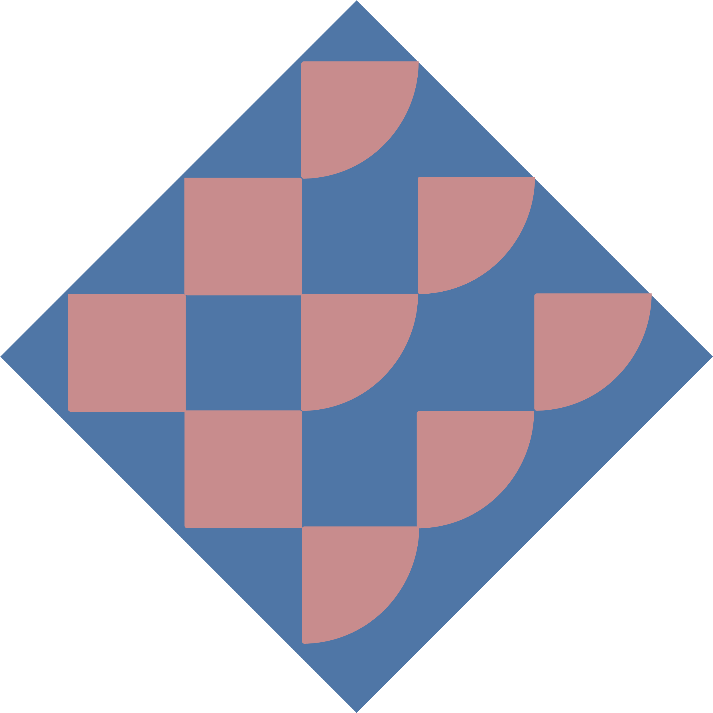
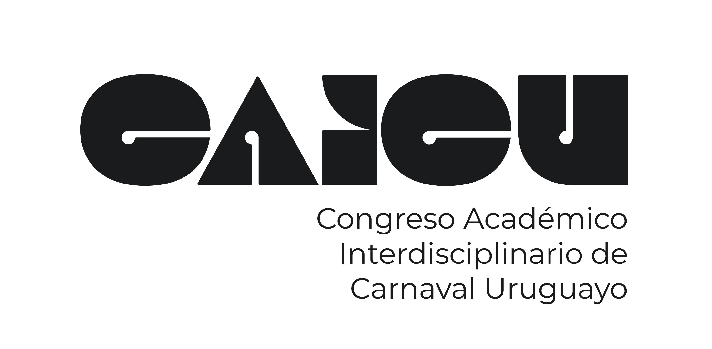
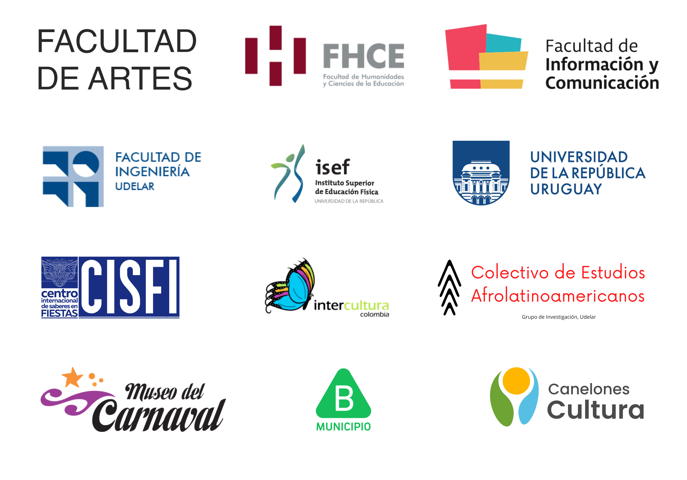
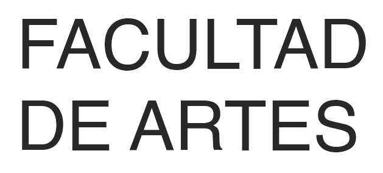
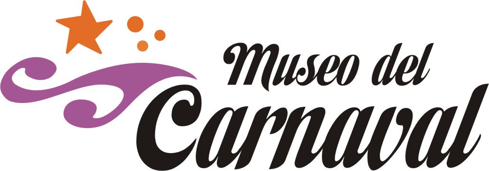

<section class="box special" id="col_angosta">
	<header class="major">
		<!-- <h2> Pisan las tablas / al tablado / estudiando el tablado </h2> -->
		<h2>Entender la fiesta</h2>
		
El carnaval es una de las fiestas populares más importantes del Uruguay. Tanto a nivel artístico y creativo como en relación a la cantidad de personas y estructuras involucradas, su relevancia para la cultura y la sociedad uruguaya es innegable. Diverso en su esencia y sus formas, el carnaval uruguayo constituye un fenómeno complejo y diverso que admite una multiplicidad de enfoques disciplinares e interdisciplinares.
		 
		 
		El CAICU propone un espacio de intercambio y encuentro entre investigadores e investigadoras de diferentes disciplinas que estudian las múltiples aristas del carnaval uruguayo con el objetivo de promover la generación de conocimiento académico interdisciplinario acerca del tema.
		La conferencia está dirigida a investigadoras e investigadores en diferentes etapas de su formación académica de todos los servicios de la Udelar y otras instituciones educativas, así como  a personas interesadas en reflexionar acerca del carnaval uruguayo.
		

	</header>
	<!--  -->
	<header class="major">
		<h2>Fechas importantes</h2>
		

			 <ul>
			  <li>Febrero 2023 - Apertura de convocatoria a presentación de trabajos</li>
			  <li>10 de Mayo de 2023 - Cierre de convocatoria a presentación de trabajos</li>
			  <li>5 al 8 de Septiembre - 1er Congreso Académico Interdisciplinario sobre Carnaval Uruguayo</li>
			</ul> 
		

	</header>
</section>

<section class="box special features">
	<h2 id="titulo_ejes"> Ejes temáticos</h2>	
	

		<section class="eje_tematico"><a id="link_header" href="/sobre-el-congreso#ejes-tematicos">
			<!--  -->
			
			<h4>Arte y carnaval</h4>
			<!-- 
Integer volutpat ante et accumsan commophasellus sed aliquam feugiat lorem aliquet ut enim rutrum phasellus iaculis accumsan dolore magna aliquam veroeros.
 -->
		</a></section>
		<section class="eje_tematico"><a id="link_header" href="/sobre-el-congreso#ejes-tematicos">
			
			<h4>El carnaval como práctica social</h4>
			<!-- 
Integer volutpat ante et accumsan commophasellus sed aliquam feugiat lorem aliquet ut enim rutrum phasellus iaculis accumsan dolore magna aliquam veroeros.
 -->
		</a></section>
		<section class="eje_tematico"><a id="link_header" href="/sobre-el-congreso#ejes-tematicos">
			
			<h4>Diferentes formas de organización del carnaval</h4>
			<!-- 
Integer volutpat ante et accumsan commophasellus sed aliquam feugiat lorem aliquet ut enim rutrum phasellus iaculis accumsan dolore magna aliquam veroeros.
 -->
		</a></section>
		<section class="eje_tematico"><a id="link_header" href="/sobre-el-congreso#ejes-tematicos">
			
			<h4>Cambios y permanencias en el carnaval</h4>
			<!-- 

 -->
		</a></section>
	

	<a href="/sobre-el-congreso#ejes-tematicos" id="button_angosto" class="button alt">Más información</a>
</section>

<!-- logos de apoyos institucionales -->
<section class="box special">
	<header class="major">
		<h2 id="header_apoyan"> Organizan</h2>
		<!-- 
 -->
			 
			<!--  width="200" height="200"> -->
			<!--  width="200" height="200"> -->
		<!-- 
 -->
		<h2 id="header_apoyan"> Apoyan</h2>
		<!--   -->
		<!-- 
 -->
			 <!-- width="200" height="200"> -->
			<!--  width="200" height="200"> -->
			<!--  width="200" height="200"> -->
			<!--  width="200" height="200"> -->
			<!--  width="200" height="200"> -->
			<!--  width="200" height="200"> -->
			<!--  width="200" height="200"> -->
			<!--  width="200" height="200"> -->
			<!--  width="200" height="200"> -->
		<!-- 
 -->
	</header>
	<!--  -->
</section>

<!-- 

	

		<section class="box special">
			
			<h3>Sed lorem adipiscing</h3>
			
Integer volutpat ante et accumsan commophasellus sed aliquam feugiat lorem aliquet ut enim rutrum phasellus iaculis accumsan dolore magna aliquam veroeros.

			<ul class="actions">
				<li><a href="#" class="button alt">Learn More</a></li>
			</ul>
		</section>

	

	

		<section class="box special">
			
			<h3>Accumsan integer</h3>
			
Integer volutpat ante et accumsan commophasellus sed aliquam feugiat lorem aliquet ut enim rutrum phasellus iaculis accumsan dolore magna aliquam veroeros.

			<ul class="actions">
				<li><a href="#" class="button alt">Learn More</a></li>
			</ul>
		</section>

	

 -->
