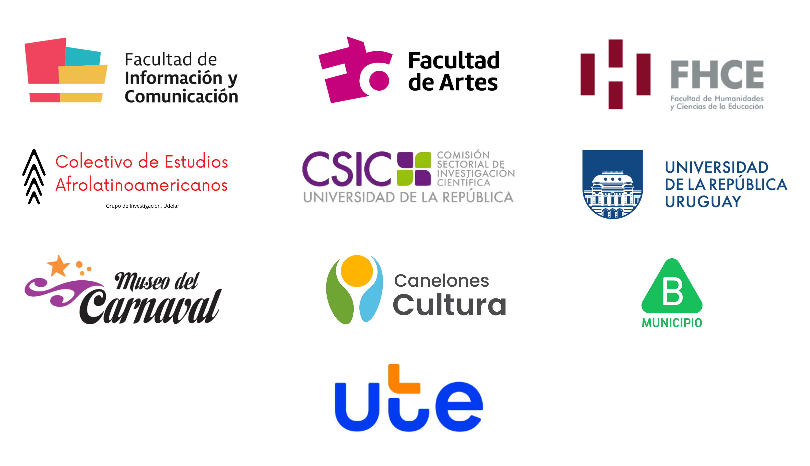

<section class="box special" id="col_angosta">
 <header class="major">
  <h2>Entender la fiesta</h2>
  
El carnaval es una de las fiestas populares más importantes del Uruguay. Tanto a nivel artístico y creativo como en relación a la cantidad de personas y estructuras involucradas, su relevancia para la cultura y la sociedad uruguaya es innegable. Diverso en su esencia y sus formas, el carnaval uruguayo constituye un fenómeno complejo y heterogéneo que admite una multiplicidad de enfoques disciplinares e interdisciplinares.
   
   
  El CAICU propone un espacio de intercambio y encuentro entre investigadores e investigadoras de diferentes disciplinas que estudian las múltiples aristas del carnaval uruguayo con el objetivo de promover la generación de conocimiento académico interdisciplinario acerca del tema.
  La conferencia está dirigida a investigadoras e investigadores en diferentes etapas de su formación académica de todos los servicios de la Udelar y otras instituciones educativas, así como  a personas interesadas en reflexionar acerca del carnaval uruguayo.
     
     
     <!-- LINK A ACTAS, LINK A PROGRAMA2023. -->
    Te invitamos a leer las <a href="https://www.colibri.udelar.edu.uy/jspui/handle/20.500.12008/45026">actas del primer CAICU (2023)</a> y a conocer el <a href="/2023/programa">programa de la edición anterior</a>. Subscribite a nuestra <a target="_blank" rel="noopener noreferrer" href="https://caicu.us21.list-manage.com/subscribe?u=3d3fbd188499d9bec7a7d6fea&id=c812a08d9b">lista de correos</a> para recibir novedades y las circulares informativas del congreso.
    

 </header>
 <header class="major">
  <h2>Fechas importantes</h2>
  

    <ul>
        <!-- Apertura de convocatoria a presentación de trabajos: 17 de Febrero (Lunes)
        Deadline: 15 de Junio 2025  (domingo)
        Resultados: 29 de Julio 2025 (Martes)
        Version para publicar: 31 de Agosto 2025 (Domingo)
        Publicar actas: 29 de Septiembre 2025 (Lunes)
        CAICU 2025: 6 al 10 de Octubre 2025 -->
     <li>17 de Febrero de 2025 - Apertura de convocatoria a presentación de trabajos <a href="/inscripcion/#presentar-un-trabajo">(ver detalles)</a></li>
     <li><s>15 de Junio</s> 15 de Julio de 2025 - Cierre de convocatoria a presentación de trabajos</li>
        <li>29 de Julio de 2025 - Comunicación de resultados de revisión de trabajos</li>
     <li><b>6 al 10 de Octubre de 2025 - 2do Congreso Académico Interdisciplinario sobre Carnaval Uruguayo</b></li>
   </ul>
  

 </header>
</section>

<section class="box special">
  

    

      

        <h2>Sede</h2>
        
Facultad de Información y Comunicación   Universidad de la República    San Salvador 1944   Montevideo, Uruguay  

      

    

    

 

<iframe src="https://www.google.com/maps/embed?pb=!1m14!1m8!1m3!1d13087.238682627953!2d-56.1730513!3d-34.9112256!3m2!1i1024!2i768!4f13.1!3m3!1m2!1s0x959f81227ade5dff%3A0x10fb4aa92a0f545b!2sFacultad%20de%20Información%20y%20Comunicación%20%7C%20FIC-UDELAR!5e0!3m2!1ses!2suy!4v1732390902117!5m2!1ses!2suy" width="100%" height="100%" style="border:0;" allowfullscreen="" loading="lazy" referrerpolicy="no-referrer-when-downgrade"></iframe>

  

</section>

<!-- logos de apoyos institucionales -->
<section class="box special">
 <header class="major">
  <h2 id="header_apoyan"> Organiza</h2>
   
  <h2 id="header_apoyan"> Apoyan</h2>
   
 </header>
</section>
